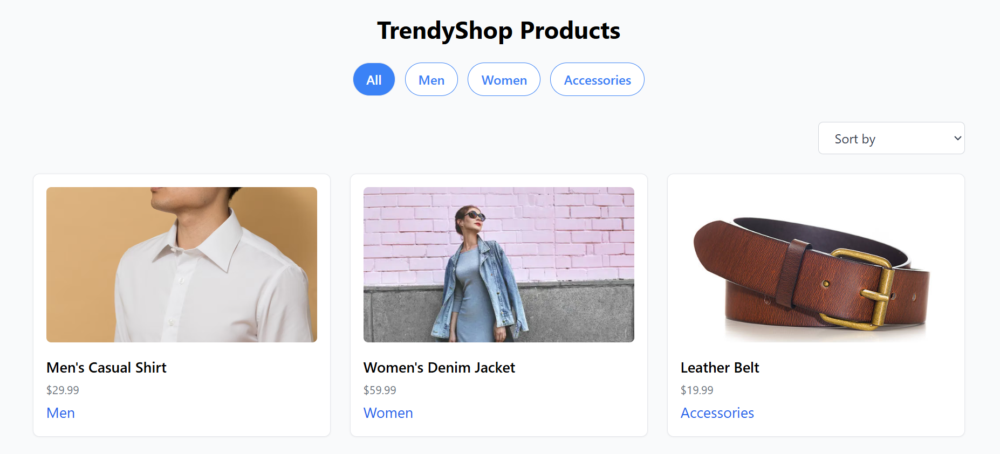

# 🛍️ TrendyShop - E-Commerce Product Listing Page

A responsive e-commerce product listing page built with **React**, **Vite**, and **Tailwind CSS**. This fictional project showcases TrendyShop's product catalog with filtering and sorting functionality using a mock API.

## 🚀 Live Demo

<!-- 🌐 [View Live Site](https://your-vercel-url.vercel.app) -->

## 📸 Preview

## 📁 Features

- ✅ Product listing for 3 categories: Men, Women, Accessories
- ✅ Category filter buttons
- ✅ Price sorting (Low to High, High to Low)
- ✅ Fully responsive layout
- ✅ Styled using Tailwind CSS
- ✅ Deployed with Vercel
- ✅ Powered by mock data (JSON)

## 🛠️ Tech Stack

- [React](https://reactjs.org/)
- [Vite](https://vitejs.dev/)
- [Tailwind CSS](https://tailwindcss.com/)
- [Vercel](https://vercel.com/)

## 📂 Folder Structure

trendyshop/
├── public/
├── src/
│ ├── components/
│ │ └── ProductCard.jsx
│ ├── data/
│ │ └── products.json
│ ├── App.jsx
│ ├── main.jsx
├── tailwind.config.js
├── postcss.config.js
├── package.json
└── README.md

## 📄 Getting Started Locally

### 1. Clone the repo

git clone https://github.com/your-username/trendyshop.git
cd trendyshop

2. Install dependencies
npm install

3. Run the dev server
npm run dev

4. Open in browser
Visit http://localhost:5173

🗃️ Mock Product Data:
Located in src/data/products.json.

## Author
Arslan Akmal
LinkedIn: www.linkedin.com/in/arslan-akmal-4a43a6300
